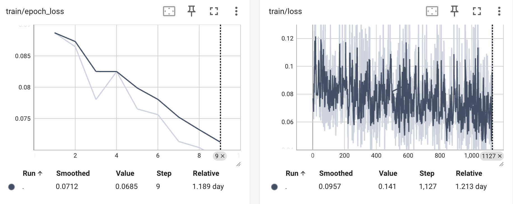

To generate the counterfactual trajectory, we fine-tune an image-to-video model [Wan2.1-I2V-480B](https://huggingface.co/Wan-AI/Wan2.1-I2V-14B-480P), following the detailed implementation from the [project](https://github.com/AINxtGen/hunyuan-video-training). 

We use the default configuration and train on 1.189 Day A100. The training loss curve is shown below: . A counterfactual trajectory from top view is provided in the [example](./example/) folder. 

For your project, you may simply replace the [example data](https://github.com/AINxtGen/hunyuan-video-training/tree/wan2.1/MCH01) with your own. We provide the sorting task from top view as [example data](./sorting_topview/). Following the suggested settings in the original [repository](https://huggingface.co/Wan-AI/Wan2.1-I2V-14B-480P), we downsample each episode to 81 frames. During inference, we use the frame at the beginning of the attack window as the input image and the attacker-specific prompt as the input text. After generating the video clip, we replace the benign clip with the generated one. 